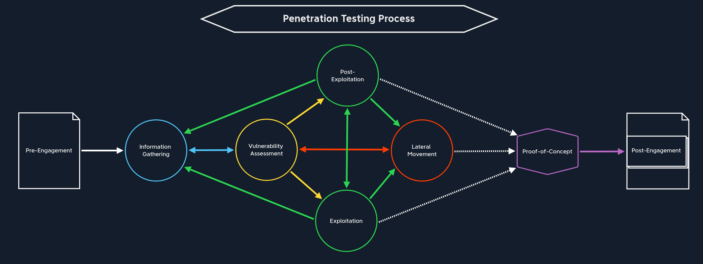

## Ethical and Legal Considerations
- Performing OSINT on a target only via public databases is legal
- Performing ANY scanning or activities that interact with ANY of an organization's systems without explicit written consent in the form of a Scope of Work (including a detailed scope of testing, contract, and rules of engagement) signed by both parties is against the law and could lead to legal and even criminal action being taken against us.
- Real-world experience on [HackerOne](https://hackerone.com/directory/programs) & [Bugcrowd](https://bugcrowd.com/programs) doing bounties, each of which have their own scope and RoE.
- Always get a copy of the contract paperwork and verify it's authenticity & scope (targets) : query anything unexpected (including during the test if additional targets are discovered by accident)
- **Everything should be in writing!** : Document, document, document.
- `Do no harm` and make sure to consider the consequences of that action : gain additional approval if in doubt.

## Penetration Testing Process

### Pre-Engagement
- Main Commitments, tasks, scope, limitations, and related agreements are documented
- Contracts & essential information are shared between testers and client
- Next step is the Information Gathering

### Information Gathering
- Identify & gain overview of target(s) : Verify they are within scope
- 